# Welcome to the wwwBank Tutorial

Learn how to build **accessible Flutter web apps** by creating a real banking dashboard.

## What You'll Build

wwwBank is a responsive banking dashboard featuring:
- **NavigationRail** adaptive layout (desktop rail, mobile bottom nav)
- **URL-based routing** with go_router
- **Web accessibility** — screen readers, keyboard navigation, ARIA semantics
- **Responsive design** — layouts that work from mobile to ultrawide
- **Forms & validation** — accessible, autofill-friendly web forms
- **Testing & deployment** — Lighthouse CI, PWA, production builds

## Learning Path

```mermaid
graph LR
    A["Ch 0: Toolkit"] --> B["Ch 1: Hello wwwBank"]
    B --> C["Ch 2: Responsive"]
    C --> D["Ch 3: Routing"]
    D --> E["Ch 4: Semantics"]
    E --> F["Ch 5: Keyboard"]
    F --> G["Ch 6: Forms"]
    G --> H["Ch 7: Visual A11y"]
    H --> I["Ch 8: Testing"]
    I --> J["Ch 9: Deploy"]
    J --> K["Ch 10: Porting"]
```



## Prerequisites

- Basic Flutter knowledge (widgets, state, layout)
- A code editor (VS Code recommended)
- Chrome browser
- Flutter SDK installed

## Quick Start

```bash
git clone https://github.com/team360r/wwwBank.git
cd wwwBank
./setup.sh
./start.sh
```

Ready? Start with [Chapter 0: Your Web Toolkit](/chapters/toolkit).
